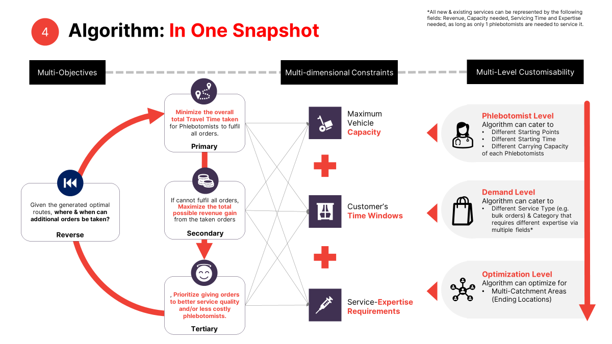

# NUS // TATA 1mg - 2 Side Demand Supply Matching

# Project Overview:
## Purpose:
Given that TATA 1mg is facing a strong growth in demand, the company aims to expand current services by providing additional on-site healthcare services. TATA 1 mg is therefore looking for an algorithmic solution to optimise target metrics, namely achieving maximum customer delight and the highest growth at an optimal cost. A scenario-based analysis is needed as well, with the consideration of multi-dimensional factors (demand, supply, temporal factors).

## Introduction to Project:
With the aim to meet Tata's requirements adequately, the following are the different components of our project:
- Demand-Supply Matching Algorithm: To generate optimal orders allocation to phlebotomists and routes to be taken that will maximise profits and reduce transit time.
- Scenario-Based Analysis: To identify the optimal business settings using data-driven methodologies. Done with simulated data that was generated to imitate currently unobserved variables, and to test the Matching Algorithm.
- API for Product Integration: To deploy the Matching Algorithm for Tata's future product integration.

# Set Up:
- Dependencies
The required packages and dependencies are located in the requirements.txt file in the repository folder. Alternatively, below is the exhaustive list of packages in the requirements.txt file.

firebase_admin==6.1.0

Flask==2.2.2

Flask_RESTful==0.3.9

folium==0.14.0

geopandas==0.12.2

marshmallow==3.12.2

matplotlib==3.7.0

networkx==3.0

numpy==1.23.5

ortools==9.5.2237

osmnx==1.3.0

pandas==1.5.2

plotly_express==0.4.1

protobuf==3.20.1

pyrebase==3.0.27

Pyrebase4==4.6.0

requests==2.28.2

scipy==1.10.0

shapely==2.0.1

streamlit==1.20.0

XlsxWriter==3.0.9

- How to configure the project (external APIs)

To configure the project, users are required to create an external Google Maps API. One can be created through your Google Cloud console, accessible through the following link:

https://console.cloud.google.com/projectselector2/apis/credentials

Once in the console, complete the following steps:
1. Click the ```Create Project``` button. The button should be located at the end of a container in the center of your screen. You will be taken to a screen where you will be prompted to assign a <b>name</b> to your project.
2. Assign a name to your project and click on the ```Create``` button.
3. If done correctly, you will be taken back to the main console page. At the top of the console page, you will see the ```+ Create Credentials``` button. Click on it, then select ```API key``` in the pop-up list of options.
4. A randomly generated API key will be created for your account. Save this API key and do not share it with others - you will be granted $300 credits as a free trial from Google. Upon usage of the credits, you will be required to <b>upgrade</b> your account, which <b>will incur billing.</b> Thus, it is important to keep this API private
5. Once you have created your API key, click on the blue ```Activate``` button at the top of the screen to activate your account and begin using your API key.
6. (Optional) As an added security measure, you can set restrictions on your API key. For instance, you can set an IP address restriction. Click the button with 3 dots lined vertically at the end of your API key in the console page. Then select ```Edit API key```. You will be taken to the API key edit page where you can select the kind of restrictions you wish to set on your API key. Select the IP address restriction and enter the IP address in the user input box. Only machines using the IP addreesses matching the ones entered will be allowed to utilise this API key. 

# 1.0 Data Simulation & Generation:
The file for Data Simulation is as follows:
- <b>DataSimulation.py</b>

Data Simulation randomly simulates high fidelity data for phlebotomists, customer orders, and catchment areas.
To simulate data, import and use the functions from DataSimulation.py as follows:
```
# read geojson polygon
polygon = gpd.read_file("Simulation\Gurugram_sample_Polygon.geojson")
# define the number of phlebotomists, orders and catchment areas
n_phleb, n_orders, n_catchment = 10, 1, 90
# set seed for reproducibility
seed = 1
# generate coordinates using generate_coords
coords = generate_coords(seed, n_phleb, n_order, n_catchment, polygon)
# create the respective dataframes 
catchment_df = create_catchment_df(seed, coords)
phleb_df = create_phleb_df(seed, coords, n_phleb, [0.8, 0.1, 0.1])
order_df = create_orders_df(seed, coords, n_order, [0.8, 0.1, 0.1])
```

## 1.1 Getting skills:

`get_skills()` returns a list of categories of services catered by the company, namely regular, premium, and special.

## 1.2 Generating coordinates:

`generate_coords(seed, n_phleb, n_order, n_catchment, polygon)` takes in a seed, the number of phlebotomists, the number of orders, and the number of catchment areas, and a GeoJson polygon. The function randomly generates points within the polygon, and the number of points generated is equivalent to the sum of the number of phlebotomists, orders, and catchment areas. The generated coordinates are divided across the locations of catchment areas, phlebotomist homes and customer orders, such that the output returned is a tuple in that order. 

## 1.3 Simulating catchment areas:

`create_catchment_df(seed, coords)` takes in a seed and the tuple of coordinates generated by `generate_coords`. It returns a dataframe of n_catchment locations of catchment areas and saves it as a csv file under the Simulated Data folder.

Columns created:
- long, lat: represents longitude and latitude of the location of each catchment area respectively. Uses coordinates generated by the `generate_coords` function. 

## 1.4 Simulating phlebotomists:

`create_phleb_df(seed, coords, n_phleb, ratio=None)` takes in a seed, the tuple of coordinates generated by `generate_coords`, number of phlebotomists, and a list representing the ratio of skills the phlebotomists take on. For example, if ratio is set as [0.7, 0.2, 0.1], approximately 70%, 20% and 10% of phlebotomists generated will have a highest skill tier of regular, premium, and special. In other words, this argument decides the highest skill tier of each phlebotomist, not accounting for the fact that phlebotomists of a higher skill level also adopt skills of lower levels. By default, the value of ratio is None and skill level is chosen from `get_skills()` under the assumption of a uniform distribution. It returns a dataframe of n_phleb phlebotomists and their relevant information, and saves it as a csv file under the Simulated Data folder.

Columns created:
- shift_start: represents the starting hour of phlebotomists’ shift. It is created by randomly generating 6 or 7.

- break_start: represents the starting hour of phlebotomists’ break. Calculated by adding 4 hours to the start of their shift.
 
- shift_end: represents the ending hour of phlebotomists’ break. Calculated by adding 8 hours to the start of their shift.

- service_rating: represents service rating of phlebotomists. Generated using a lognormal distribution, with a mean of 4.5 and standard deviation of 0.1.

- expertise_regular, expertise_premium, expertise_special: represents whether the phlebotomist possesses the regular, premium and special level of expertise respectively in binary form - with 1 being yes. Phlebotomists of higher expertise necessarily possess lower levels of expertise. If phlebotomists have been assigned a maximum skill level of special (i.e., expertise_special equals 1), then they also have regular and premium expertises (i.e., expertise_regular and expertise_premium also equals 1). If phlebotomists have been assigned a maximum skill level of premium, then they also have regular expertise.

- cost: represents the cost of hiring for the month. Regular, premium, and special phlebotomists cost 800, 900 and 1000 respectively, and these values are stored in a dictionary within the function. 

- capacity: represents the maximum amount of inventory each phlebotomist can carry at a time. All phlebotomists are given a carrying capacity of 20.

- long, lat: represents longitude and latitude of phlebotomists’ home or starting location respectively. Uses coordinates generated by the `generate_coords` function. 

- gender: represents the gender of phlebotomists in binary form, 0 being male. The probability of a male phlebotomist being generated is 70%.

- phleb_id: represents ID of each phlebotomist. Uses the index of the dataframe to uniquely identify each phlebotomist. 

## 1.5 Simulating customer orders:

`create_orders_df(seed, coords, n_order, ratio=None)` takes in a seed, the tuple of coordinates generated by `generate_coords`, number of orders, and a list representing the ratio of services chosen by customers. For example, if ratio is set as [0.7, 0.2, 0.1], approximately 70%, 20% and 10% of all orders generated are from regular, premium, and special categories respectively. By default, the value of ratio is None and each order requested is randomly assigned a category from `get_skills()` under the assumption of a uniform distribution. It returns a dataframe of n_order customer orders and its relevant information and saves it as a csv file under the Simulated Data folder.

Columns created:
- order_start: represents the starting hour of time window selected by the customer, ranging from integers 6 to 14 inclusive. The probability of orders being generated between 6am and 10am is 60%.

- service_regular, service_premium, service_special: represents whether the customer chooses regular, premium, and special services respectively in binary form – 0 representing absence. For each customer, a random number of services, ranging from 1 to 3, is generated. Given the number of services "selected" by each customer, the category of services is then assigned without replacement to each service that is selected. 

- duration: represents the total time to complete a customer’s order based on the services chosen. Each service is assumed to take 15 minutes to complete, and these values are stored in a dictionary within the function. 

- price: price: represents the total revenue earned from completing a customer’s order based on the services chosen. Regular, premium, and special services cost 200, 300, and 400 respectively, and these values are stored in a dictionary within the function. 

- buffer: represents buffer time given to each order. Integer between 10 and 15 inclusive are randomly generated.

- capacity_needed: represents the capacity needed in order to fulfill the customer's request. Assuming that each service requires 1 carrying capacity, the total capacity needed is equal to the number of services requested by the customer.  

- long, lat: represents longitude and latitude of the location the customer respectively. Uses coordinates generated by the `generate_coords` function. 

- requested_female: represents the whether the customer requests for a female phlebotomist, 1 being yes. The probability of a customer requesting for a female phlebotomist is 20%.

- order_id: represents ID of each customer order. Uses the index of the dataframe to uniquely identify each order.

# 2.0 Feature Engineering:
The file for Feature Engineering is as follows:
- <b>FeatureEngineering.py</b>

Feature Engineering covers all the required data processing before running the Matching Algorithm. There are 2 main parts in the FeatureEngineering.py, namely Time Matrix and other Pre-processing codes. *Please note that Feature Engineering codes require the input dataframes (orders, catchments, and phlebotomists) to follow strictly the columnar formats as stipulated in the section "Data Simulation & Generation".

## 2.1 Time Matrix part:

```create_time_matrix(address_list, api)``` takes in a list of address_list, which can be generated using ```get_coordinates_list(orders_df, catchments_df, phlebs_df)``` from other Pre-processing codes, and a Google Map API key (refer to Requirements). This is the main function we will call. Output is a 2-D array consisting of the travel time between each locations in a square matrix format. This ```create_time_matrix``` is supported by the following functions:

- ```send_request(origin_addresses, dest_addresses, API_key)``` takes in a list of origin addresses, a list of destination addresses, and a Google Maps API key, to actually send request to the Google Distance Matrix API and fetch the JSON result. Output is a dictionary of the fetched API result.

- ```secondsToMinutes(seconds)``` takes in a integer value of seconds, which is the default return unit of the Google Distance Matrix API, and converts it into minutes. Output is an integer value.

- ```build_time_matrix(response)``` takes in the dictionary response from ```send_request``` function and make it into the 2-D array output we see in the ```create_time_matrix``` function.

## 2.2 Pre-processing part:
Please note that all the functions under Pre-processing, except ```get_weightedRatingCost_list```, takes in 3 arguments, namely Orders dataframe, Catchments dataframe, and Phlebotomists dataframe. This is to simplify the input requirements, but not all dataframes are used within each function itself.

```get_coordinates_list(orders_df, catchments_df, phlebs_df)``` gets the coordinates of locations in the format of "lat,long", which is the required format for Distance Matrix API in the ```create_time_matrix``` function. The generated coordinates are strictly in the following sequence: Catchment location/s, followed by Phlebotomists starting locations, and lastly Order locations.

```get_timeWindows_list(orders_df, catchments_df, phlebs_df)``` gets time windows of locations in the format of a tuple, consisting of start window (in minutes, e.g 6am would be 6*60 = 360) and end window (which is just 60 min + start window). The generated time windows are in the same sequence as ```get_coordinates_list```: Catchment, followed by Phlebotomists starting locations, and lastly Order locations. For catchment area, the time window is mostly trivial and set to be the working hour - e.g. 6am to 6pm (6 * 60, 18 * 60). Generally, if the orders' latest time windows are by 2pm, phlebotomists will return to the catchment area immediately after servicing the last order at 2pm regardless of catchment's end window. However, please feel free to change the end window of the catchment area to "force" phlebotomists to reach catchment area before the designated end window time. Phlebotomists' time windows are just his/her shift starting time. Orders' time windows are when the phlebotomists _must arrive_ within to service the order - note that the phlebotomists can _service_ over the time window (especially when the servicing time is long).

```get_servicingTimes_list(orders_df, catchments_df, phlebs_df)``` gets an array of the _servicing time + buffer time_ of locations. The sequence is again start with Catchment area (which is trivial and set as 0), followed by phlebotomists (trivial, set as 0), and lastly the orders'. 

```get_orderRevenues_list(orders_df, catchments_df, phlebs_df)``` gets an array of the "price"/revenue of locations. The sequence is again start with Catchment area (which is trivial and set as 1), followed by phlebotomists (trivial, set as 1), and lastly the orders'. 

```get_orderCapacities_list(orders_df, catchments_df, phlebs_df)``` gets an array of the capacities required in each locations. The sequence is again start with Catchment area (which is trivial and set as 0), followed by phlebotomists (trivial, set as 0), and lastly the orders'. Capacities required refer, for example, to the blood samples the phlebotomist need to carry from the order, represented by integer value. During the Matching Algorithm, the sum of order capacities cannot exceed phlebotomists' capacities which is obtained from ```get_phlebCapacities_list```. 

```get_phlebCapacities_list(orders_df, catchments_df, phlebs_df)``` gets an array of the maximum capacities a phlebotomist can carry in a single trip. 

```get_weightedRatingCost_list(phlebs_df, rating_weight = 1, cost_weight = 1)``` gets an array of weighted costs (salary cost + inversed service rating) of a phlebotomist. Depends on whether Service Quality is more prioritized or Cost is more prioritized, different weights can be inputted to the function to influence the weighted numbers. This array is used for Tertiary Objective function (described in section "Matching Algorithm").

```get_serviceExpertiseConstraint_list(orders_df, catchments_df, phlebs_df)``` gets an array of N-length array where N is the number of Phlebotomists 
with the relevant expertise required for the order location at the index of the array. Basically, for each order (represented by the index), there is an array consisting of phlebotomist index which can service that order. 

```get_metadata(orders_df, catchments_df, phlebs_df)``` gets a dictionary containing important information of the Orders and Phlebotomists (such as but not limited to, Order ID, Phleb ID, etc).

# 3.0 Matching Algorithm:
The files for Matching Algorithm are as follows:
- <b>MatchingAlgorithm.py</b>
- <b>Run Algorithm.ipynb</b>

The Matching Algorithm has been built using OR-tools, an <b>Open Source</b> software packages developed by Google, to solve optimization problems. In the most simplest form, our Matching Algorithm is solving a mixed variations of Vehicle Routing Problem (VRP), including but not limited to Capacitated Vehicle Routing Problem (CVRP), which is a difficult combinatorial problem containing both the Bin Packing Problem and the Traveling Salesman Problem (Ralphs et al., 2003). Highly customised to the needs of Tata 1mg business, our Matching Algorithm fulfils the following criterias:

- <b>Multi-Objectives</b>
    - <b>Primary Objective</b>: Minimize the overall total Travel Time taken for phlebotomists to fulfil all orders.
    - <b>Secondary Objective</b>: If cannot fulfil all orders, Maximize the total possible Revenue Gain from the taken orders.
    - <b>Tertiary Objective</b>: Prioritize giving orders to phlebotomist with better Service Quality and/or lower Cost.

    - In addition to these 3 objective functions, we have also implemented a <b>Reverse objective function</b> that takes in a previously generated Optimal Routes from the Matching Algorithm and return a list of available phlebotomists and time windows given a new customer's order location. This allows for incremental matching without re-running the whole Matching Algorithm. Application-wise, it allows us to make this a Closed-loop solution and truly extending the Primary Objective of reducing travel times - which in turns allow Tata 1mg team to take on more orders and thus pushing the maximum revenue frontier. 

- <b>Multi-Dimensional Constraints</b>
    - Maximum Carrying Capacity per phlebotomist in a single trip
    - Customer Time Windows
    - Service-Expertise Constraint

- <b>Multi-Level Customisabilities</b>
    - <b>Phlebotomist Level</b> <br>
        The Algorithm can cater to different Starting Points, different Starting Time, and different Carrying Capacity of <b>each</b> Phlebotomists.

    - <b>Demand Level</b> <br>
        The Algorithm can cater to existing, as well as new upcoming, different Order Types (e.g. bulk orders, specialised services), as every service types can possibly be represented by decomposing into these columns when inputing into the Algorithm: Revenue, Capacity needed, Servicing Time and Expertise required. This applies as long as it is assumed that only 1 phlebotomist will be required to service the order. 

        E.g Bulk Order of 5, can be represented by 5x Revenue, 5x Capacity needed, and 5x Servicing time in a single row within the inputted dataframe for the Algorithm. 

    - <b>Optimization Level</b> <br>
        In addition to the default Single-catchment (endpoint) optimization scenario, the Algorithm also provides an optimization option for Multi-catchment (multiple endpoints) use-case. This allows for the potential leverage of the vast lab locations Tata 1mg team has and could result in an even more optimal routing solution. 
<br>



## 3.1 How to use the Matching Algorithm

There are 3 main functions to call from the ```MatchingAlgorithm.py```, they are namely:

- ```run_algorithm(orders_df, catchments_df, phlebs_df, api_key, isMultiEnds = False)``` takes in 3 dataframes, a Google Maps API key, and an optinal Boolean variable to indicate whether "Multi-catchment" optimization option is selected. Please note that, even if the Boolean variable is not indicated, if the function detects that the inputted "catchments_df" has more than 1 row, the function will automatically switch to "Multi-catchment" optimization mode. The function will return the Optimal Routes in JSON format.

- ```run_algorithm_version_timeMatrix(orders_df, catchments_df, phlebs_df, time_matrix)``` takes in 3 dataframes and a 2-D time matrix array which can be generated using ```create_time_matrix``` function from ```FeatureEngineering.py```. There is no need to input Google Maps API key into the function, as the function will not be generating the time matrix within itself, and instead use the time matrix given in the input. This function is useful when you want to reduce the calls to Google Distance Matrix API (to reduce costs associated with it). This is also useful for our Scenario-based Testings (section 5), where it requires a custom time matrix that is simplified using for example, Euclidean distance, instead of actual travel time. **Important**: this function does not support "Multi-catchment" optimization option, as by design the "Multi-catchment" optimization must use the Google Maps API key. The function, same as ```run_algorithm``` function, returns the Optimal Routes in JSON format.<br> <br>These 2 main functions for Matching Algorithm are supported by the following helper functions:
    
    - ```create_data_model(time_matrix, time_window, revenues, num_vehicles, servicing_times, expertiseConstraints, orders_capacities, phlebs_capacities,  cost_rating_weight, metadata)``` takes in all the necessary features generated using functions in ```FeatureEngineering.py``` and return a Dictionary of features for the model to reference during the optimization process. **Important**: the Or-tools model only accept integer value (float is not allowed). 

    - ```output_jsonify(data, manager, routing, solution)``` takes in the dictionary of data generated by ```create_data_model``` above, and 3 custom objects of Manager, Routing, and Solution respectively that are initialised during the ```run_algorithm``` functions when running the optimization model - and simply return the Optimal Routes result in nested JSON. This is used when "Multi-catchment" optimization is not enabled.

    - ```output_jsonify_verMultiEnds(data, manager, routing, solution, catchments_coordinates, api_key)``` takes in the same inputs as the ```output_jsonify``` function, but additionally, it also requires a 1-D array of catchment_coordinates and the Google Maps API key. This is only used when "Multi-catchment" optimization is enabled. Internally, it checks all the possible endpoints from the array of catchment_coordinates and map each routes to the closest endpoint before returning the final Optimal Routes result in nested JSON format. 

- ```reverse_getVacancy_algorithm(order_coord, required_servicing_time, required_expertise_list, algo_routes_json, api_key)``` takes the coordinate-string of a new order ("lat,long" without spacing), an integer value (representing minutes needed for the servicing time), a list of the required expertises, and the previously generated Optimal Routes result JSON, and the Google Maps API key. It returns a non-nested JSON for a list of _possible combinations of vacant phlebotomists and time windows_ to take on the new order, specifically, below are the columns of information returned by the JSON:

    - PhlebotomistIndex - **Index** of the phlebotomists that are available. You may want to map it back "phleb_id" using ```metadata``` section of the ```algo_routes_json`` input, depending on your use-case.
    - TotalTravelTime - The	result is **ordered** by "TotalTravelTime" ascendingly. The Phlebotomist-Time-Window combination that has the lowest "TotalTravelTime" will be placed first, as lower the "TotalTravelTime", the more optimal it is towards the global optimality of the Matching Algorithm.
    - TimeWindowStart - The start of the time window for the new order
    - TimeWindowEnd	- The end of the time window the new order
    - FromLocIdx - The Location Index the phlebotomist need to service before taking the new order
    - ToLocIdx	- The Location Index the phlebotomist will service next after taking the new order
    - FromLocCoordinates - The Location Coordinates the phlebotomist need to service before taking the new order
    - ToLocCoordinates - The Location Coordinates the phlebotomist will service next after taking the new order

<br>

For an example code usage of the Matching Algorithm , you may refer to the ```Run Algorithm.ipynb```. 

<br>

For the details on the code implementation of the Matching Algorithm model, please refer to the comments written in the ```MatchingAlgorithm.py```, as well as the Source code of Google OR-tools for routings - [link](https://github.com/google/or-tools/blob/main/ortools/constraint_solver/routing.h#L2861.).

# 4.0 Prescriptive Analysis:
The files for Matching Algorithm are as follows:
- <b>MatchingAlgorithm.py</b>
- <b>Run Algorithm.ipynb</b>

The Prescriptive Analysis function has been built on top of the Matching Algorithm function combined with Monte Carlo Simulation - with an aim to answer the following question: given a ratio of demands for different types of services (e.g Regular, Premium, and Special), what is the optimal ratio of expertise amongst the Phlebotomists.

```run_prescriptive_analysis(orders_df, catchments_df, phlebs_df, time_matrix, regular_ratio, premium_ratio, special_ratio)``` takes in 3 dataframes, a 2-D time matrix array, and the ratios of demand for Regular, Premium, and Special services respectively. 

- Prior to running the function above, you need to generate a Base datasets of Orders, Phlebotomists, and Catchments. You may refer to ```DataSimulation.py``` on how to generate the simulated data. Note that, for Phlebotomists data, we need to generate "**excess**" phlebotomists, meaning if there are 100 orders, we need to generate 60 phlebotomists with equal ratio across the expertises (e.g 20:20:20). Excess phlebotomists is important, so that the Matching Algorithm will select for us the ideal list and ratio of phlebotomists. For Catchment data, we only need 1 row - multi-catchments is not allowed and it won't affect the analysis meaningfully too. 

- When running the function, internally, it will "shuffle" the Orders for 10 times without violating the Ratios inputted. Therefore, the function will return an array of 10 values instead of 1, which can be _averaged out_ to get a final number. The "shuffling" process is important to eliminate the edge scenarios and take on a more holistic view of the Prescriptive Analysis.

- We can run the function multiple times with a list of different Demand Ratios, and then visualise changes in Expertise ratios in accord to that. 

- Complete implementation can be viewed in the ```Run Algorithm.ipynb```.


# 5.0 Scenario-based Testings on Algorithm:
The files for Scenario-based Testings are as follows:
- <b>Box&Dot output.ipynb</b>

Scenario-based testings provides 5 different test cases that fucntions as a testing tool to validate our matching algorithm and demonstrate the flexibility and robustness of the matching algorithm, It helps to check if the output corresponds to what we deem is the optimal route given the different scenarios.  

This notebook works with a simple coordinate layout which calls on ```MatchingAlgorithm.run_algorithm_version_timeMatrix(orders_df, catchments_df, phlebs_df, time_matrix)```. The dataframe required for this function is the same as ```run_algorithm``` namely, the 3 csv files for the Orders, Phlebotomist and Catchment area. As this testing uses a simple coordinate layout, the longitude and latitude in the files should be edited to the y and x-axis of the points used in the box and dot diagram respectively. Sample input files has been stored under Simulated Data/Box & Dot Data for your reference.

To obtain the time matrix for the box and dot scenarios, ```get_dist_btw_pts(x)``` and ```get_boxplot_timeMatrix(points)``` takes a list of coordinates required for the scenario according to Catchment area, Phlebotomist starting coordinate and Customer Orders coordinates in the order of the time windows indicated. Do note that each unit of coordinate corresponds to 60min travelling time for consistency and simplicity. You may check the ```output``` in the JSON file generated.

The 5 Test Cases shows the following functionalities:
1. Basic Performance
2. Time Window Constraints
3. Multi-dimensional Constraints and Multi-Objectives
4. Customisability: Capacity-Constraints
5. Customisability: Phlebotomist Ratings

# 6.0 Route Visualisation:
The files for Route Visualisation are as follows:
- <b>RouteVisualisation.py</b>

Route Visulisation makes use of folium and osmx packages to plot an interactive and realistic map of the routes which phlebotomists take based on the Matching Algorithm's output. The markers can be clicked on to show more details about each location, and the file is saved as a Route.html file under the Route Visualisations folder.

`visualise_routes(json_result, polygon)` takes in the json result returned from the Matching Algorithm, and the same geojson polygon that is used to generate coordinates during DataSimulation. The function iterates through the route taken by each phlebotomist, and assigns each stop along the route to the nearest node possible using the osmnx package. The path between each node is then drawn onto a folium map, and the respective markers and information such as arrival and departure time are added. `create_popup(text)` is used to create these clickable pop-ups for each marker. `to_time(time_window)`  converts the time window given in the json output to actual time to be displayed in the popups.

# 7.0 API and Proof of Concept
## Files and Back-End
The files for our API and Proof of Concept (POC) Streamlit interface are as follows:
- <b>ApiFlask.py</b>
- <b>ApiStreamlit.py</b>

ApiFlask contains the code required for locally hosting a Flask web application. The algorithm and output generated are called from the ApiStreamlit file, and this involves calling the API hosted by launching the ApiFlask file.

ApiStreamlit contains the code for the Streamlit interface. It contains several tabs, each with different functionality, such as amending and getting data, namely Phlebotomist data, Catchment Area data, and Optimal Route data. We are using a Firebase Realtime Database as the back-end storage. This storage contains the Phlebotomist and Catchment Area data. We retrieve data from this secure database in order to run our Matching Algorithm. Below are the functions contained in the ApiStreamlit.py file and what they return

```get_catchment()``` takes no arguments and retrieves the Catchment area data from Firebase and returns a Pandas DataFrame object containing the Catchment Area data

```get_phleb()``` takes no arguments and retrieves the Phlebotomist data from Firebase and returns a Pandas DataFrame object containing the Phlebotomist data

```get_routes_api(orders, catchment, phleb, API_key, isMultiEnds)``` takes 4 arguments. 
-```orders``` refers to a <b>csv</b> file that will require the user to input. We do not store order data on Firebase as order data contains data that changes each day, and even during the day
- '''catchment``` refers to the Catchment Area data which will be retrieved from Firebase using the aforementioned ```get_catchment()``` function
- '''phleb``` refers to the Phlebotomist data which will be retrieved from Firebase using the aforementioned ```get_phleb()``` function
- ```API_key``` is ```String``` which refers to the user's Google Maps API key
- ```isMultiEnds``` is a Boolean ```True``` or ```False``` indicating to the Matching Algorithm on whether to use Multi-Ending catchments or not to generate the optimal Phlebotomist routes


## 7.1 Before Running
Ensure that you are using version 3.20.1 of protobuf, as newer/older versions may experience compatibility issues with the packages used in the API files. This can be done in the command line using:
```
pip install protobuf=3.20.1
```

## 7.2 Running the API and Streamlit Interface
To run and interact with the Streamlit interface, first run the ApiFlask.py file. This can be done in the command line using:
```
cd PATH_TO_FILE_DIRECTORY
python ApiFlask.py
```
This begins locally hosting the Flask web application, which will enable the Streamlit interface to call the Matching Algorithm functions from the API.
Once done, open another command prompt and type the following:
```
cd PATH_TO_FILE_DIRECTORY
python ApiStreamlit.py
```
This will launch the tabular Streamlit interface

## 7.3 Streamlit Features
Tab 1 of the interface is titled "Get Available Timeslots", which allows you to obtain an available timeslot of a Phlebotomist that can serve a customer, given the customer's latitude and longitude information. After inputting the latitude and longitude of the customer/order, you will be prompted to enter your Google Maps API key, as well as to select the type of service that the customer/order requires. Once all the above information has been provided, a dataframe containing all the available timeslots will be displayed. This will show the Phlebotomist that are able to take this order, as well as information about where the Phlebotomists' last location is at (and at what time he/she is at that location) before starting to travel to the requested order location. The function displayed in this tab assumes that the optimal routes have already been generated for the day. If no routes are available for the day yet, there is no need to check the available time slots as there will be none.

Tab 2 of the interface is titled "Get Output", which allows you to obtain the optimal routes of the Phlebotomists in ```JSON``` format. To generate the routes, you are required to provide a CSV file containing the orders data, as well as a Google Maps API key. Once that has been provided, the Streamlit interface will call the API from the Flask application and run the Matching Algorithm. Depending on the size of the order CSV data file provided, the algorithm may take up to a couple of minutes to run. Once it has completed the algorithm, a button "Get Optimal Routes" will appear. Clicking it will download the routes generated as a JSON to your computer.

Tab 3 of the interface is titled "Get Output (3 CSVs), which also allows you to obtain the optimal routes of the Phlebotomists in ```JSON``` format. The difference between <b>Tab 3</b> and <b> Tab 2</b> is that Tab 3 requires the user to input the Phlebotomist and Catchment data in addition to the Order data, whereas Tab 2 only requires the user to input Order data. This is because Tab 2 retrieves Phlebotomist and Catchment data from the external Firebase Realtime Database storage. Users will still be required to enter their own Google Maps API key into this tab to obtain the generated routes.

# Citations

- Ralphs, T. K., Kopman, L., Pulleyblank, W. R., &amp; Trotter, L. E. (2003). On the capacitated vehicle routing problem. Mathematical Programming, 94(2-3), 343–359. https://doi.org/10.1007/s10107-002-0323-0 
